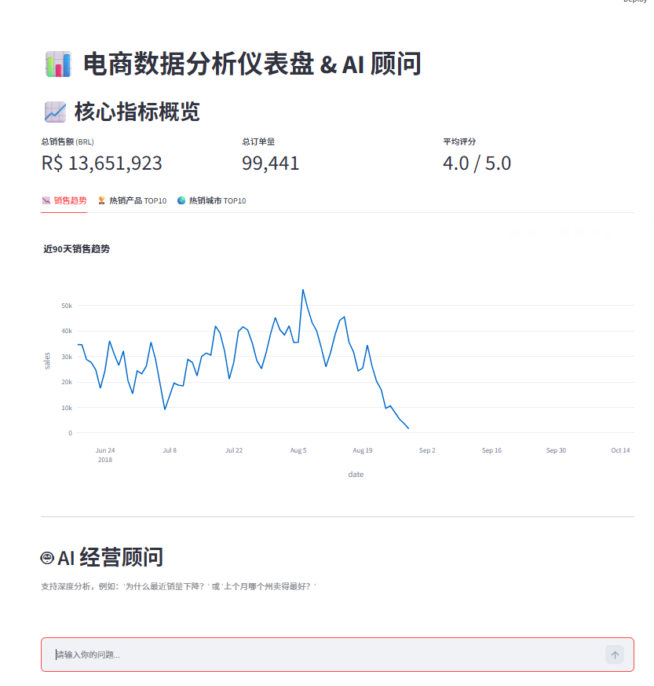
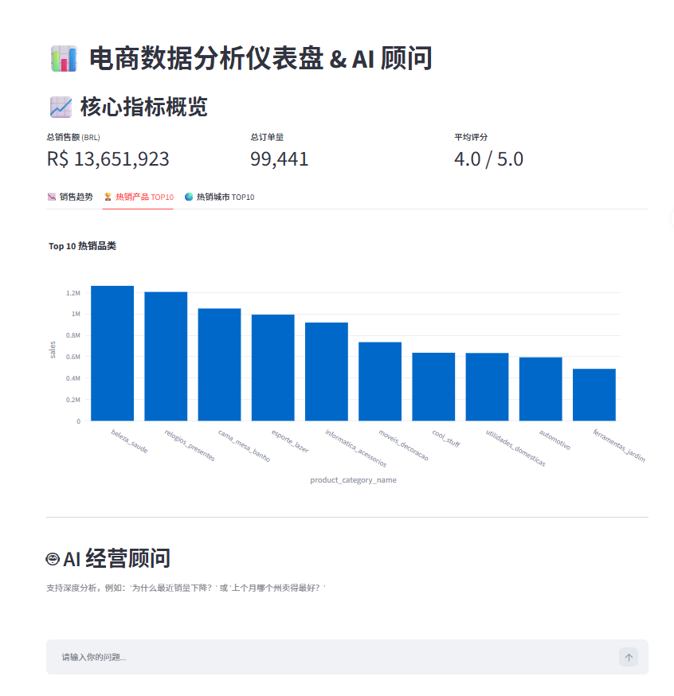
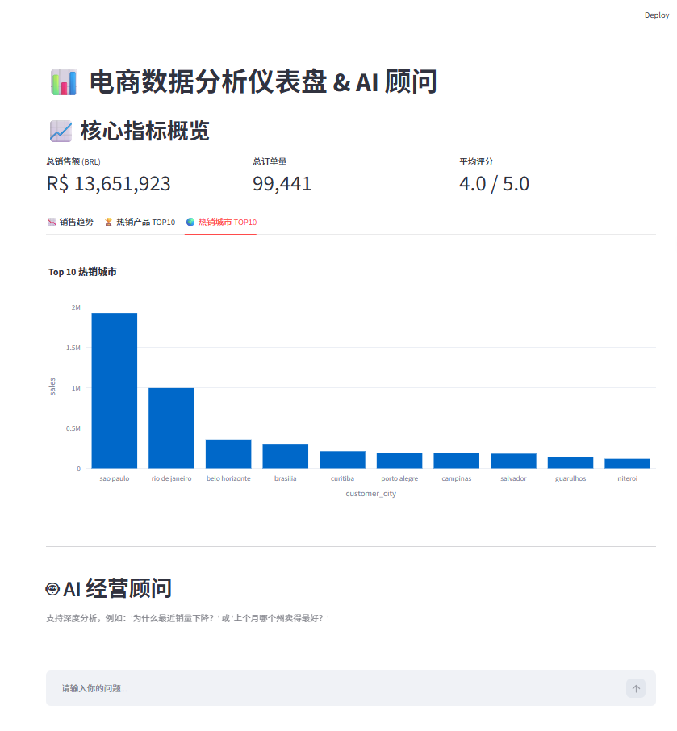
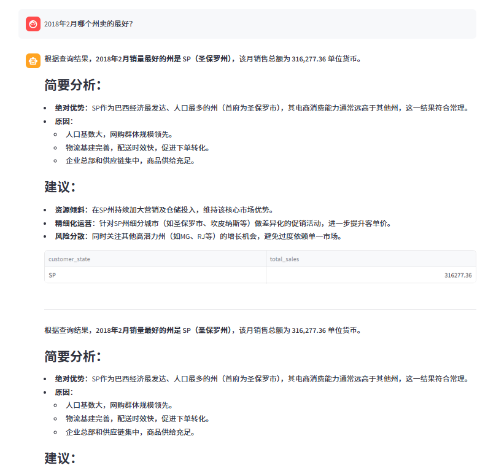

# AI Sales Intelligence Platform

An AI-powered business intelligence platform that combines data engineering, SQL analytics, visualization, and Large Language Models (LLMs) to enable natural language-driven sales analysis.

---

## Overview

AI Sales Intelligence Platform is built on the Olist Brazilian E-commerce Dataset and provides an end-to-end analytics workflow from raw data processing to AI-powered business insights.

The platform allows users to interact with e-commerce data using natural language. By leveraging DeepSeek LLM, user questions are automatically translated into SQL queries, executed against a MySQL database, and converted into actionable business insights.

The goal of this project is to bridge traditional Business Intelligence (BI) systems with modern AI technologies, creating a more intuitive and intelligent data analysis experience.

---

## Key Features

### Data Engineering

* Import and process raw Olist datasets
* Clean and standardize multiple data sources
* Handle missing values and inconsistent records
* Build a unified sales analysis wide table

### Database Construction

* Store cleaned data in MySQL
* Integrate customers, orders, products, sellers, payments, and reviews
* Create a centralized analytics database for business reporting

### Business Intelligence Dashboard

* Total sales overview
* Order volume monitoring
* Average customer review score
* Sales trend analysis
* Top product category analysis
* Top city sales analysis

### AI-Powered Analytics

* Natural Language to SQL generation
* Automated database querying
* AI-generated business explanations
* Interactive AI business assistant

### Data Visualization

* Interactive dashboard built with Streamlit
* Dynamic visualizations powered by Plotly
* KPI monitoring and performance tracking

---

## Tech Stack

| Category               | Technologies  |
| ---------------------- | ------------- |
| Programming Language   | Python        |
| Data Processing        | Pandas        |
| Database               | MySQL         |
| ORM / Database Engine  | SQLAlchemy    |
| Database Driver        | PyMySQL       |
| Dashboard              | Streamlit     |
| Visualization          | Plotly        |
| LLM Integration        | DeepSeek API  |
| Environment Management | Python-dotenv |

---

## Project Structure

```text
AI-Sales-Intelligence-Platform/

├── app.py
│   └── Streamlit dashboard and AI assistant

├── data_clean.py
│   └── Data cleaning and wide table construction

├── deepseek_api.py
│   └── DeepSeek API integration and SQL generation

├── requirements.txt

├── README.md

├── .env.example

├── .gitignore

├── screenshots/

└── olist-data/
    └── Raw Olist dataset files
```

---

## System Workflow

```text
Raw Olist Dataset
        ↓
Data Cleaning (Pandas)
        ↓
MySQL Database
        ↓
Sales Wide Table
        ↓
Natural Language Question
        ↓
DeepSeek LLM
        ↓
SQL Generation
        ↓
Database Query
        ↓
Business Insight Generation
        ↓
Interactive Dashboard
```

---

## Example Business Questions

The platform can answer questions such as:

* What was the total sales revenue in May 2018?
* Which state generated the highest sales in 2018?
* What was the best-performing month in 2018?
* What are the top-selling product categories?
* Which cities contributed the most revenue?
* What is the average review score?

---

### Project Demo

**1. Key Metrics & Sales Trend**


**2. Top Products & Cities Distribution**
<div style="display: flex; gap: 10px;">
  
  
</div>

**3. AI Business Advisor Deep Analysis**


## Installation

### 1. Clone the Repository

```bash
git clone https://github.com/your-username/AI-Sales-Intelligence-Platform.git
```

### 2. Install Dependencies

```bash
pip install -r requirements.txt
```

### 3. Configure Environment Variables

Create a `.env` file:

```env
DEEPSEEK_API_KEY=your_api_key

MYSQL_USER=root
MYSQL_PASSWORD=your_password
MYSQL_HOST=localhost
MYSQL_PORT=3306
DB_NAME=ecommerce_db
```

### 4. Build the Database

```bash
python data_clean.py
```

This step will:

* Create the MySQL database automatically
* Load Olist datasets
* Build the analytical sales_wide_table

### 5. Launch the Dashboard

```bash
streamlit run app.py
```

---

## Current Version

### Version 1.0

Implemented Features:

* Data cleaning pipeline
* MySQL database integration
* Sales analysis wide table construction
* Streamlit business dashboard
* Natural language querying
* SQL generation using LLM
* AI-powered business analysis

---

## Current Limitations

* Limited multi-step reasoning
* Occasional LLM hallucinations
* No automated report generation
* No customer segmentation module
* No advanced forecasting models

---

## Future Roadmap

### Version 1.1

* Improve SQL validation
* Reduce LLM hallucinations
* Enhance response reliability

### Version 1.2

* Month-over-Month (MoM) analysis
* Year-over-Year (YoY) analysis
* Top-N intelligent analytics

### Version 1.3

* Advanced Plotly visualizations
* Enhanced dashboard experience
* Automated chart generation

### Version 2.0

* RFM customer segmentation
* Automated business reports
* Multi-step AI Analyst Agent
* Intelligent recommendation engine

---

## Dataset

This project uses the Olist Brazilian E-commerce Dataset, a public e-commerce dataset containing over 100,000 orders.

The dataset includes:

* Customer information
* Order records
* Product information
* Seller information
* Payment transactions
* Customer reviews

It provides a realistic business environment for analytics and decision-support applications.

---

## Author

Developed as a practical project to explore the integration of:

* Data Engineering
* Business Intelligence
* SQL Analytics
* Large Language Models (LLMs)
* AI-Powered Decision Support Systems

The project represents a transition from traditional automation workflows toward AI-driven analytics and intelligent agent systems.
